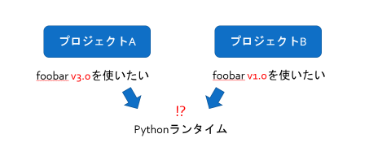
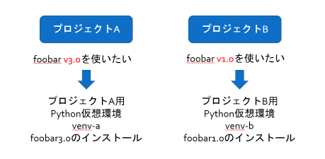

# Python と Jupyter のインストールと実行

## やることリスト

* Python のインストール
* venv 環境の構築
* Jupyter のインストール

# Python のインストール

## Python 入ってますか？

Windows には Python が入っていませんが、Mac OS や Linux には Python が入っています。

まずは、インストール済みの Python のバージョンを確認します。
コマンドプロンプト(Windows)などの環境で、 `python -V`と入力します。

今回は Python3.6 を使用します。今回の学習環境では conda 向けには書いてありません。公式の Python での説明になっています。

## Windows の場合(コマンドプロンプト)

```bat
C:\Users\Taro>python -V
Python 2.7.15
```

上記は python 2.7.15 を示しています。

## macOS / Linux の場合

```bash
$ python -V
Python 2.7.15
```

python 3.x.x がインストールされている場合、python3 というコマンドになっている場合があります。

```bash
$ python3 -V
Python 3.6.5
```

## Python のインストール(Windows 版)

Windows で Python を利用する場合は、Python の公式サイトで配布されている Windows インストーラを利用します。

2019 年 1 月現在の最新バージョンは 3.7.2 ですが、互換性の問題があるライブラリがあるため、ここでは 3.6.7 を使用します。

「 Python Release Python 3.6.7 」（<https://www.python.org/downloads/release/python-367/>）をブラウザで開きます。  
OS によって以下のいずれかのインストーラーをダウンロードし、ウィザードに従ってインストールします。

64 ビット版: [Windows x86-64 executable installer](https://www.python.org/ftp/python/3.6.7/python-3.6.7-amd64.exe)
32 ビット版: [Windows x86 executable installer](https://www.python.org/ftp/python/3.6.7/python-3.6.7.exe)

##### Add Python 3.6 to PATH

この時、「Add Python 3.6 to PATH」にチェックを入れておきましょう。自動的に必要な環境変数が設定されます。


画像は 3.3.6 になっていますが、3.6.7 も同様

## Python のインストール(macOS 版)

Mac OS で Python3 をインストールする方法には、Python の公式サイトで配布されている MacOS インストーラを利用する方法と、オープンソースのパッケージ管理ツールである Homebrew（または MacPort）を利用する方法があります。

ここではインストーラを使う方法を紹介します。
2019 年 1 月現在の最新バージョンは 3.7.2 ですが、互換性の問題があるライブラリがあるため、ここでは 3.6.7 を使用します。
「 Python Release Python 3.6.7 」（<https://www.python.org/downloads/release/python-367/>）をブラウザで開きます。

OS によって以下のいずれかのインストーラーをダウンロードし、ウィザードに従ってインストールします。

10.9 以降: [macOS 64-bit installer](https://www.python.org/ftp/python/3.6.7/python-3.6.7-macosx10.9.pkg)
10.6 以降: [macOS 64-bit/32-bit installer](https://www.python.org/ftp/python/3.6.7/python-3.6.7-macosx10.6.pkg)

## Python のインストール(Linux 版)

Linux ではディストリビューションのパッケージマネージャ(yum, apt 等）で Python3.6 をインストールします。

ディストリビューション（バージョン）によっては、ソースからのコンパイルが必要です。

## Python のドキュメント

下記の URL に日本語の Python3.6.5 のドキュメントがあります。

<https://docs.python.jp/>

## 確認 ✔

コマンドプロンプトなどから、Python のバージョンを確認して 3.6.7 と表示されること

Windows

```bat
C:\Users\Taro>python -V
Python 2.7.15
```

macOS / linux

```bash
$ python3 -V
Python3 3.6.7
```

# venv 仮想環境の構築

## venvとは?

Pythonには機械学習ライブラリを含む様々なオープンソースのライブラリが存在し、パッケージとして提供されています。

ひとつのPythonランタイムを、別々のプロジェクトで共用した場合、それぞれのプロジェクトのライブラリのバージョンが競合する可能性があります。



Pythonランタイムから、プロジェクトごとにライブラリ保管場所を作るツールがvenvです。

venvを使うことで、ひとつのPythonランタイムから、クリーンなPython環境を複数作成できます。

このように作成されたPython環境を「仮想環境」と呼びます



## venvで仮想環境をつくる

コマンドプロンプトで下記のように入力します。

環境によってPython3.6がpython3のようになっている場合があります。

```
python –m venv 仮想環境フォルダ名
```

Windows
```bat
C:\Users\Taro>python -m venv myvenv
```

macOS / linux
```bash
$ python3 -m venv myvenv
```

## 仮想環境のアクティブ化

仮想環境をアクティブにすることで、仮想環境内のPythonを使うようになります。

仮想環境を有効化するとコマンドプロンプトの前に仮想環境名が（）内に表示されます。

この状態で後述するパッケージマネジャーコマンドpipを使ってライブラリを管理します。

Windows
```bat
C:\Users\Taro>myvenv\Scripts\activate

(myenv) C:\Users\Taro>
```

macOS / linux
```bash
$ source myenv/bin/activate
(myenv) $
```

## 仮想環境の無効化

仮想環境を無効化するには`deactivate`コマンドを実行します。

仮想環境から離脱してグローバルなPythonを使う形に戻ります。

Windows
```bat
(myenv) C:\Users\Taro>deactivate
C:\Users\Taro>
```

macOS / linux
```bash
(myenv) $ deactivate
$
```

## (補足)Anaconda環境の場合

Anacondaディストリビューションの場合、パッケージ管理と仮想環境の管理を行うcondaというコマンドを使います。

```
$ conda create --name myvenv python # 環境を作成 
$ source activate myvenv # 環境の有効化 
(myvenv) $ conda install requests # パッケージのインストール 
(myvenv) $ source deactivate # 環境の無効化
```

## 確認 ✔

仮想環境の作成、アクティブ化、無効化ができること。

